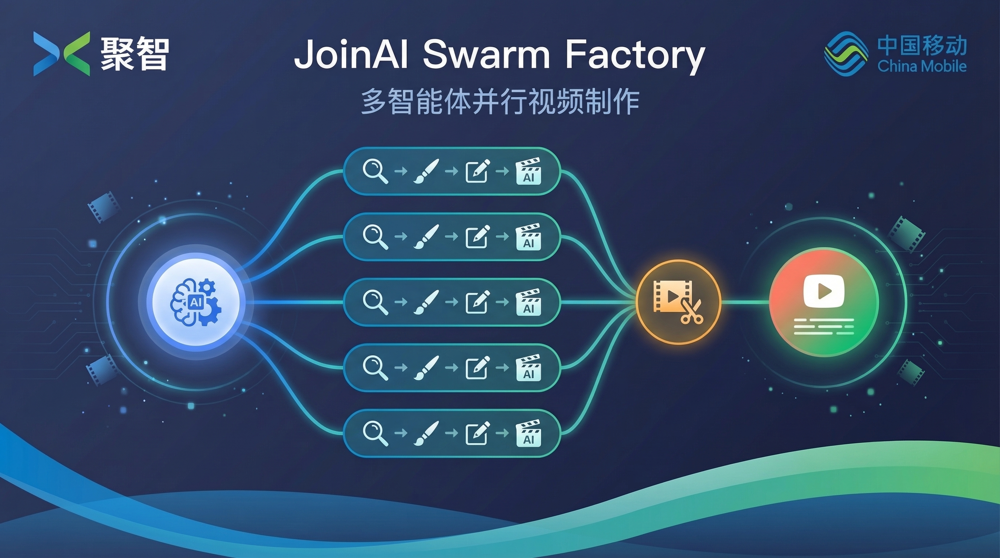
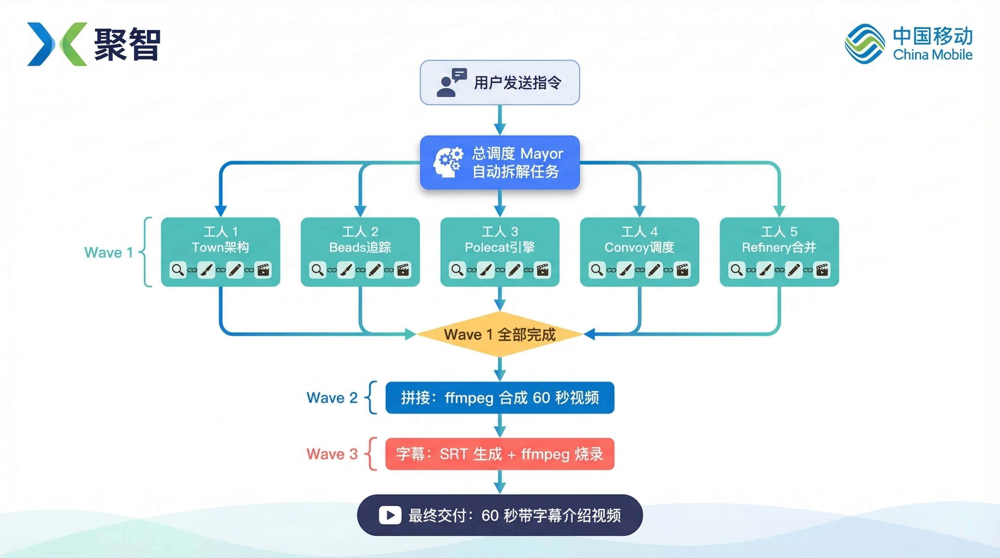
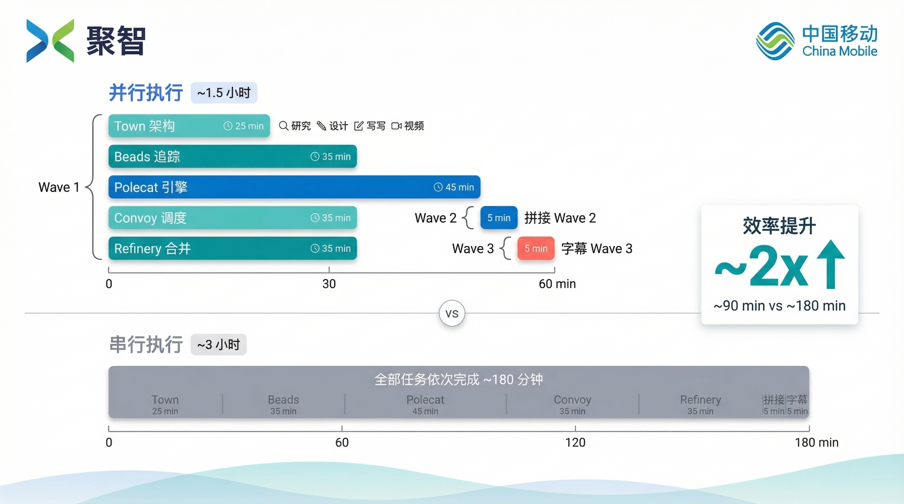
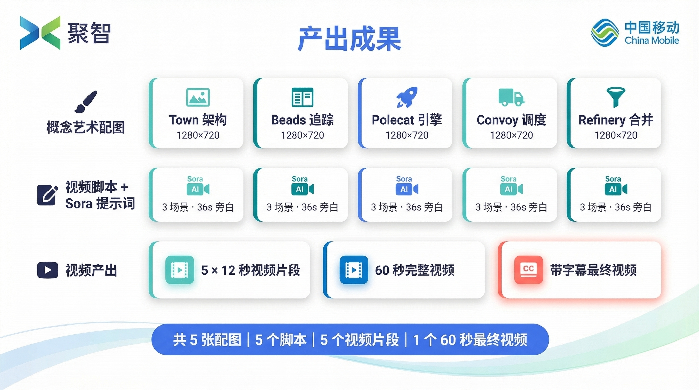

# JoinAI Swarm Factory 多智能体并行视频制作 — 完整工作流程

## 概述

本示例通过 JoinAI Swarm Factory 的多智能体并行编排能力，由 AI 总调度（Mayor）自动完成任务拆解，同时派发 5 个 AI 智能体并行执行跨模态内容创作任务——每个智能体独立完成代码库研究、概念艺术配图生成、视频脚本撰写、Sora AI 视频片段生成的完整流水线，最终经自动拼接和字幕烧录，产出一段 60 秒的产品介绍视频。全过程无需人工干预。

## 示例背景

本运行示例为 JoinAI Swarm Factory（聚智 Gastown）制作产品工作流程介绍视频，覆盖 5 个核心概念：Town/Rig/Mayor 智能小镇架构、Beads 任务追踪系统、Polecat 并行执行引擎、Convoy 工作追踪与调度、Refinery 合并队列。7 个智能体跨越多种模态——从源代码研究到 AI 配图生成、视频脚本撰写、Sora 视频合成、ffmpeg 拼接与字幕烧录——最终产出 5 张概念艺术配图、5 个视频脚本、5 个 12 秒 AI 视频片段及 1 段 60 秒带字幕的完整介绍视频。

## 核心能力：多智能体跨模态并行创作

传统方式下，单个 AI 需依次完成 5 组"研究 → 配图 → 脚本 → 视频"创作流水线，再串行执行拼接和字幕烧录，串行耗时约 3 小时。JoinAI Swarm Factory 采用三阶段 Wave 编排架构：Wave 1 同时调度 5 个独立智能体并行执行跨模态创作流水线，Wave 2 自动拼接视频片段，Wave 3 自动生成字幕并烧录，实际耗时约 1.5 小时，效率提升约 2 倍。

## 执行流程

### 阶段一：任务下发

用户连接至 Mayor（总调度 AI），提交结构化任务说明，包括：5 个 Gastown 核心概念主题、配图规范（电影级概念艺术风格、1280×720 分辨率）、视频脚本格式（3 场景 × 12 秒）、Sora 视频生成参数、三阶段 Wave 依赖关系等。任务下发后，后续流程由系统自动驱动，无需用户持续参与。

### 阶段二：环境初始化

Mayor 接收任务后，自主完成以下初始化工作：

- 创建项目仓库并推送至 GitHub
- 将仓库注册至 JoinAI Swarm Factory 管理体系
- 创建 7 个任务工单（5 个 Wave 1 跨模态创作 + 1 个 Wave 2 视频拼接 + 1 个 Wave 3 字幕烧录），并建立 Wave 间依赖关系
- 部署 Convoy 工作追踪面板，支持实时进度监控

### 阶段三：5 智能体并行跨模态创作（Wave 1）

Mayor 同时调度 5 个 AI 智能体（Polecat），各自负责一个核心概念主题：

- 智能体 1 — Town/Rig/Crew/Mayor 智能小镇架构
- 智能体 2 — Beads 任务追踪系统
- 智能体 3 — Polecat 并行执行引擎
- 智能体 4 — Convoy 工作追踪与调度
- 智能体 5 — Refinery 合并队列

5 个智能体各自运行于独立的隔离工作空间，互不干扰，并行推进。每个智能体需完成完整的跨模态创作流水线：

1. **研究**：阅读 Gastown 源代码和文档，理解所负责概念的核心机制
2. **配图生成**：撰写配图提示词，调用 AI 图片生成工具产出 1280×720 电影级概念艺术配图
3. **脚本撰写**：编写 3 场景视频脚本，包含中文旁白和英文 Sora 视觉提示词
4. **视频生成**：整合 Sora 提示词与中文旁白，调用 Sora 生成 12 秒视频片段（含中文语音解说）

完成后自动提交成果、清理工作环境并退出。

### 阶段四：视频拼接（Wave 2）

系统内置依赖检查机制。当 5 个 Wave 1 任务全部完成后，拼接任务自动解除阻塞。拼接智能体使用 ffmpeg 将 5 个 12 秒视频片段按序拼接为 60 秒完整视频。

### 阶段五：字幕烧录与归档（Wave 3）

Wave 2 完成后，字幕任务自动解除阻塞。字幕智能体从 5 个视频脚本中提取中文旁白，生成 SRT 字幕文件，再使用 ffmpeg 烧录硬字幕到最终视频。全部 7 个任务标记完成，Convoy 工作追踪面板关闭，任务自动归档。

## 效率分析

- 并行实际耗时：约 1.5 小时
- 串行预估耗时：约 3 小时
- 效率提升：约 2 倍

实际提升为 2 倍而非 5 倍，原因在于：5 个智能体共享 AI 接口调用配额（图片生成和 Sora 视频生成均有速率限制），Sora 视频生成是主要耗时瓶颈（每个片段需等待 30–120 秒），且 Wave 2 拼接和 Wave 3 字幕烧录必须串行执行。

## 交付成果

本运行示例共产出三类交付物：

**5 张概念艺术配图**（1280×720，电影级概念艺术风格）：

- Town/Rig/Mayor 智能小镇架构
- Beads 全息任务看板
- Polecat 并行执行引擎
- Convoy 工作追踪车队
- Refinery 合并质量门禁

**5 个视频脚本 + 5 个 Sora 提示词**：

- 每个脚本包含 3 个场景、36 秒中文旁白、对应的英文 Sora 视觉提示词
- 每个 Sora 提示词包含统一风格前缀、场景描述和中文语音旁白

**视频产出物**：

- 5 个 12 秒 AI 视频片段（Sora 生成，含中文语音解说）
- 1 个 60 秒完整拼接视频
- 1 个带硬字幕的最终交付视频
- 1 个 SRT 字幕文件

## 总结

1. **跨模态内容创作同样适用多智能体并行**。JoinAI Swarm Factory 的能力不局限于文本研究或数据分析，AI 配图生成、视频脚本撰写、Sora 视频合成等多模态创作同样可通过多智能体并行高效完成。

2. **三阶段 Wave 编排实现复杂依赖管理**。Wave 1 并行创作、Wave 2 串行拼接、Wave 3 串行字幕的三阶段流水线，在保证依赖关系的同时最大化并行度，展示了多智能体编排处理复杂工作流的能力。

3. **AI 工具链的端到端串联**。每个智能体独立完成从代码库研究到配图生成、脚本撰写再到 Sora 视频合成的完整闭环，展示多种 AI 工具（图片生成、视频生成、ffmpeg 音视频处理）的无缝协作。

4. **全流程高度自动化**。从任务下发到最终带字幕视频交付，7 个智能体自动协作，无需人工介入。每个智能体完成后自动提交成果、清理环境、退出工作空间。
